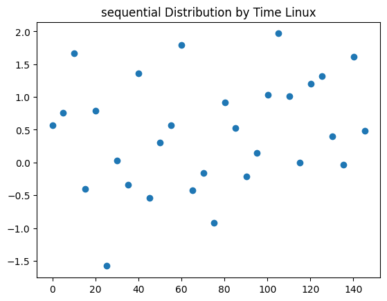
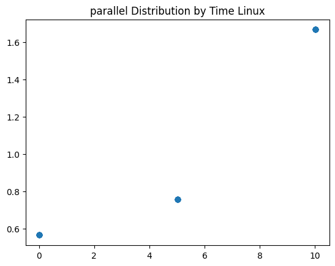
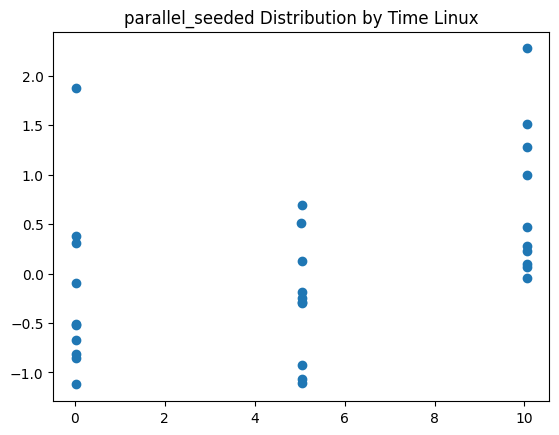
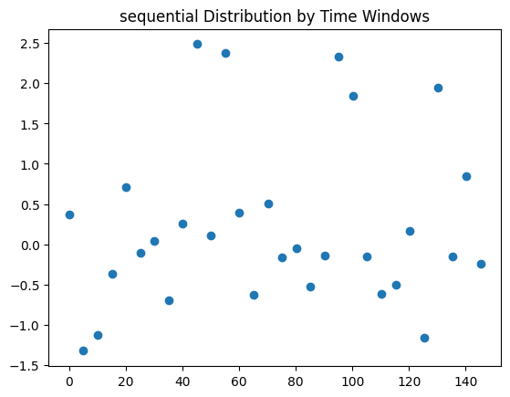
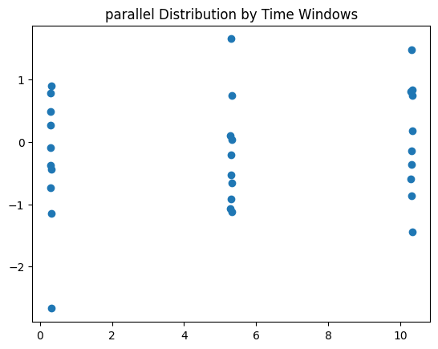
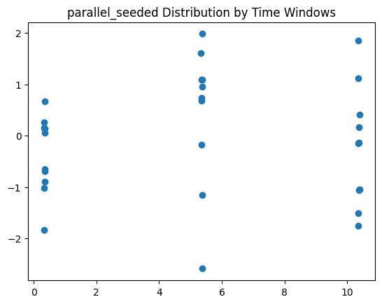

# Multiprocess Random Number Generation

As part of a homework assignment, I noticed some strange behavior when it came to random numbers being generated in a multiprocess program. In particular, I suspected that all
processes that were running at the same time were using the same random seed. 

In this repository, I explore this in a simple dummy multiprocess random number generation application. 

## Platforms

* Windows 10, Python 3.9.6
* Ubuntu 20.04, Python 3.10.12

## Dependencies

One of the Python versions listed above as well as `pip`. In the commands below, I use `python3`, but it may be `python` depending on your system configuration.

```bash
python3 -m pip install -r requirements.txt
```

## Running 

Run: 

```bash
python3 work.py 
```

This takes a few minutes. It will create a `data/` directory.

Then run: 

```bash
python3 analysis.py
```

This will take less than a minute and will create a `plots/` directory.

## Discussion 

My primary discovery was that processes on Linux share the same random state. This can be seen looking at [this file](plots/parallel_states_linux.txt) and [this file](plots/parallel_variance_linux.txt). The first file shows the tabulation of random states and the second shows variance of generated random numbers. In both we see there are 3 sets of the same 10 states (and numbers). Contrast this with the other `states` and `variance` files which have unique states and numbers.

This can be seen in the comparison of figures 1 and 2 below. This problem can be solved by setting a seed in each spawned process that's unique to the process. Figure 3 shows this with `PID x TIME` used as the seed. Process IDs are reused on Linux so the PID on its own is not sufficient.

This has also been seen previously ([here](https://stackoverflow.com/questions/9209078/using-python-multiprocessing-with-different-random-seed-for-each-process)). 

|  |
| :--: |
| Figure 1 |

|  |
| :--: |
| Figure 2 |

|  |
| :--: |
| Figure 3 |

However, Windows processes seem to have different random states. See the `states` and `variances` files in `plots/`.

Compare figures 4 and 5 with figures 1 and 2. Figure 6 uses `PID x TIME` as seeds just for completeness.

|  |
| :--: |
| Figure 4 |

|  |
| :--: |
| Figure 5 |

|  |
| :--: |
| Figure 6 |

## Acknowledgements

* [Chami Lamelas](https://sites.google.com/brandeis.edu/chamilamelas) - author